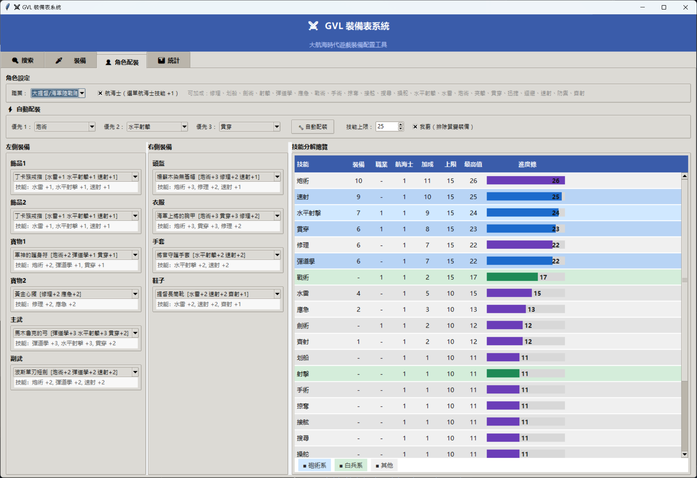

# GVL 裝備表系統

大航海時代傳說 的裝備配裝計算工具，提供桌面 GUI 圖形介面，支援角色配裝技能計算與裝備搜尋。

## 🚀 快速開始

### 1. 安裝依賴
```bash
pip install -r requirements.txt
```

### 2. 啟動 GUI（推薦）
```bash
python main.py gui
```

## 🖥️ GUI 介面功能

### 開啟畫面預覽


### 角色配裝計算（主頁）
- 選擇**職業**與是否為**航海士**
- 透過下拉選單選擇各部位裝備（飾品、寶物、主武、副武、頭盔、衣服、手套、鞋子）
- 使用 **⚡ 自動配裝** 可依優先技能快速產生配裝方案
- 可勾選 **我窮（排除質變裝備）**，自動配裝時不納入名稱含「(質變)」的裝備
- 下拉選項直接顯示**裝備名稱＋技能加成**，例如：
  ```
  土耳其禁衛軍長槍  [識破+3 速射+2 掠奪+2]
  ```
- 選擇裝備後，下方即時顯示詳細技能提示
- 右側**技能分解總覽**即時計算並以色塊長條圖呈現所有技能加總（含裝備、職業、航海士加成）

### 裝備搜尋（第二頁）
- 依名稱、技能、部位搜尋裝備
- 搜尋結果顯示每件裝備完整技能列表

## 🎨 技能分類色系

| 顏色 | 分類 |
|------|------|
| 🔵 藍色 | 砲術系（砲術、水平、彈道、貫穿、速射） |
| 🟢 綠色 | 白兵系（突擊、戰術、射擊） |
| 🟣 紫色 | 其他技能 |

## 其他啟動方式

```bash
# 網頁應用
python main.py web
# 電腦可開 http://127.0.0.1:5000
# 手機同 Wi-Fi 可開 http://<你的電腦IP>:5000

# 命令列工具
python main.py cli search --name "戒指"
python main.py cli search --skill "炮術" --min-level 2
```

若只想本機存取，改用：`python main.py web --host 127.0.0.1`

## ☁️ 公開部署（Render）

### 一鍵部署

[](https://render.com/deploy)

### 手動部署步驟

1. Fork 或 Push 此 repo 到你的 GitHub 帳號。
2. 前往 [Render](https://render.com) → **New → Web Service**。
3. 連結你的 GitHub repo。
4. 設定如下：

   | 欄位 | 值 |
   |------|----|
   | **Runtime** | Python |
   | **Build Command** | `pip install -r requirements.txt` |
   | **Start Command** | `gunicorn wsgi:app --bind 0.0.0.0:$PORT --workers 2 --timeout 120` |

5. 點 **Create Web Service**，等待部署完成後取得公開 HTTPS 網址。

> **提示**：`render.yaml` 已內含上述設定，若使用 Render Blueprint 可自動套用。

### 環境變數（選填）

| 變數 | 說明 | 預設 |
|------|------|------|
| `GVL_API_ALLOW_ORIGIN` | CORS 允許來源 | `*` |

---

## 🌐 提供外部網頁工具讀取（API）

- 角色即時計算：`POST /api/character/calculate`
- GUI 自動配裝：`POST /api/character/suggest-builds`
- API 端點已支援 CORS，可由外部網頁直接呼叫
- 可用環境變數 `GVL_API_ALLOW_ORIGIN` 指定允許來源（預設 `*`）

## 📊 資料規模

- **總裝備數**: 56 件
- **位置類型**: 8 種
- **技能種類**: 24 種

- ## 特別感謝:鎮魂歌  有人整理資料才有資料可以搞
